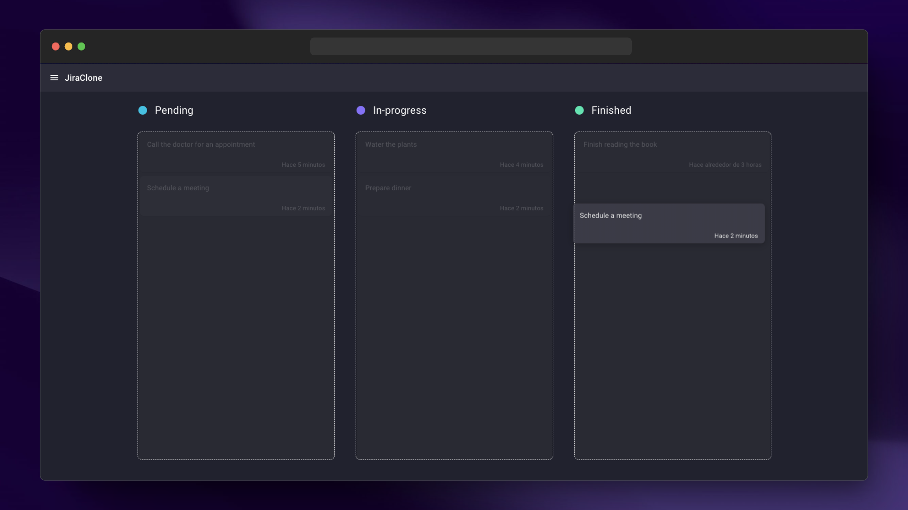

# Jira-Clone



## 💻 Prerequisites

Before getting started, please make sure you have the following requirements:

- [NodeJS](https://nodejs.org/es/)
- [Docker](https://www.docker.com/)

### 🛠 Using Docker with Jira-Clone (required for the database)

```
docker-compose up -d
```

### Fill the database with information

Make a request to the endpoint:

```
http://localhost:3000/api/seed
```

## 🚀 Installing Jira-Clone

To use the project, follow these steps:

```
git clone https://github.com/danielcgilibert/Jira-Clone.git
```

```
cd jira-clone
```

```
yarn
```

```
yarn dev
```
